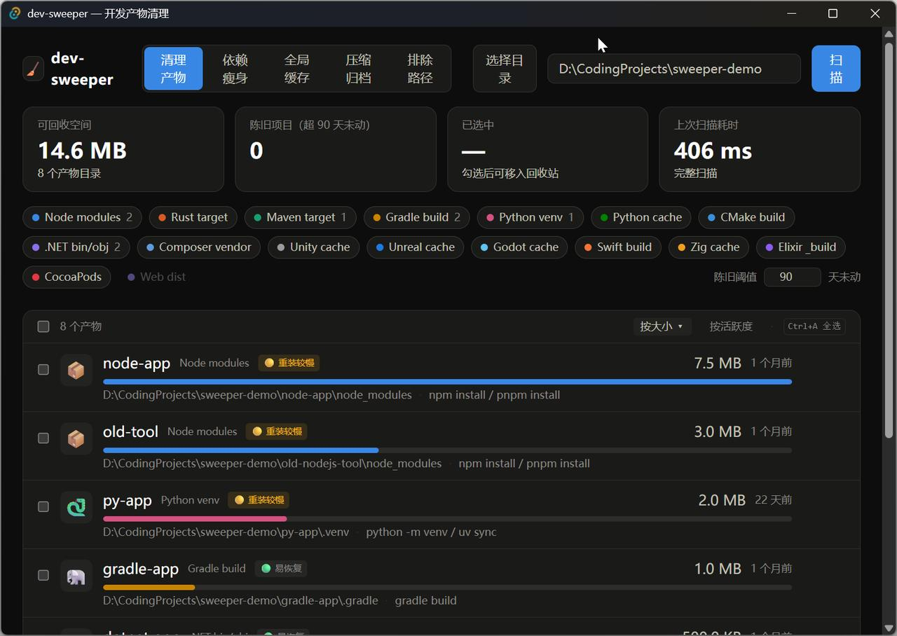
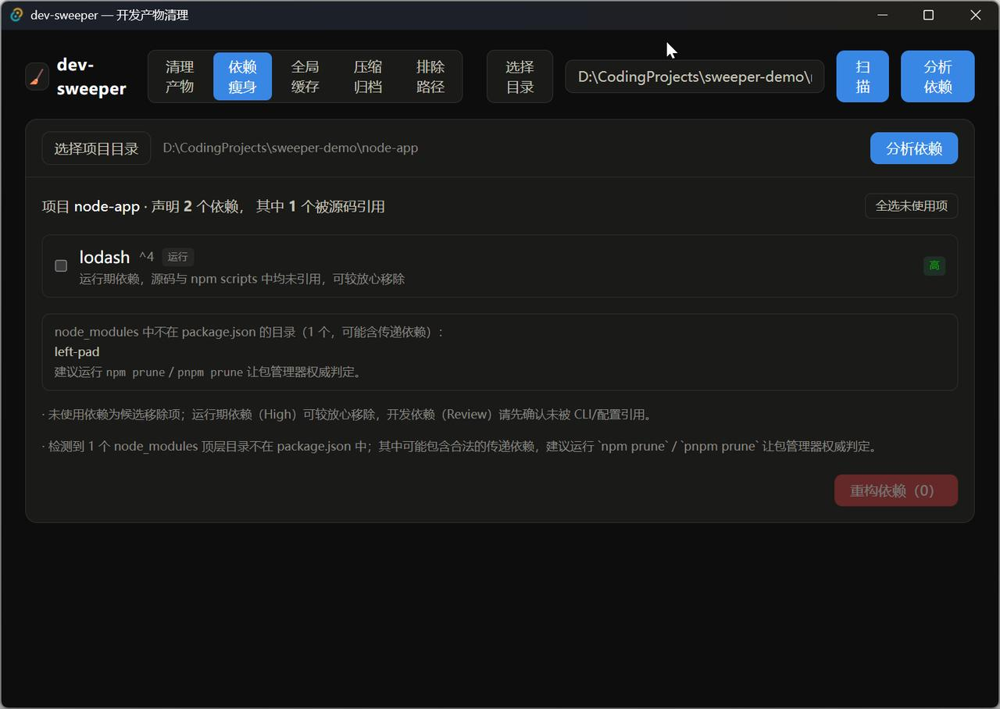

# dev-sweeper

[](https://github.com/IKEASven69/dev-sweeper/actions/workflows/ci.yml)
[](https://github.com/IKEASven69/dev-sweeper/releases)
[](LICENSE)

**一次扫描，找回被开发产物吃掉的磁盘。** 并扫 17 个生态的 `node_modules` / `target` / `build` / `.venv` / `__pycache__`…，按**大小 × 陈旧度**排序，批量**移入回收站**——不 `rm -rf`、不永久删除、每一步可逆。

<p align="center">
  
</p>

> 给"怕删错"的人做的清理工具：删除一律进回收站，误删随时恢复；每个产物都带"怎么再生成"的提示（`pnpm install` / `cargo build` …）；「排除路径」白名单在核心层硬拒绝，护住你重要的目录。

## ✨ 五大能力

| 能力 | 一句话 |
|---|---|
| 🧹 **产物清理** | 多生态并扫，大小 × 最后活跃排序，一键全选陈旧项，批量进回收站 |
| 🩹 **依赖瘦身** | 精准找出 `package.json` 里声明了却从未用到的依赖——扫源码 import、npm scripts、CSS/配置文件引用后仍判"未使用"才列出，按置信度分级 |
| 📦 **pnpm / uv 迁移** | 迁到内容寻址存储，同一份包跨项目只存一份；失败可完整回退 |
| 🧽 **清全局缓存** | npm / pip / cargo / maven / gradle / go / uv / pnpm 的共享缓存集中清理——它们不在项目里，普通清理碰不到 |
| 🗜️ **压缩归档** | 沉睡项目整体压成 `.tar.gz` 移出工作区，源码不丢、随时一键解回（"不删也能瘦"） |

桌面 GUI（Tauri 2 + React 19）与 CLI（`sweep`）共享同一个 Rust 扫描核心。

## 📥 安装

### 桌面版

从 [Releases](https://github.com/IKEASven69/dev-sweeper/releases) 下载最新版：

| 平台 | 文件 |
|---|---|
| Windows | `dev-sweeper_<版本>_x64-setup.exe` |
| macOS | `*_x64.dmg` / `*_aarch64.dmg` |
| Linux | `*.AppImage` / `*.deb` / `*.rpm` |

### CLI（`sweep`）

Releases 附带各平台单文件二进制（`sweep-windows-*.exe` / `sweep-darwin-*` / `sweep-linux-*`），下载即用；或源码构建：

```
cargo build --release -p dev-sweeper-cli   # 产出 target/release/sweep
```

## 🚀 快速上手（GUI）

1. **选目录** —— 粘贴或浏览你的项目根目录（比如 `D:\Projects`）
2. **扫描** —— 产物实时流入列表，大小渐进填充；超过阈值未活跃的自动挂"陈旧"徽标
3. **预演** —— 点「先预演」只校验不删除，先看看会发生什么
4. **清理** —— 勾选（或一键"全选陈旧项"）→ 确认 → 全部移入回收站
5. **后悔药** —— 删错了去回收站原样恢复；列表里每条都写着这个目录怎么再生成

<p align="center">
  
</p>

依赖瘦身、全局缓存、压缩归档都在顶栏的标签页里，同样有预演 + 确认两道闸。

**保护重要目录**：在「排除路径」里加入的目录，扫描清理和压缩归档**所有入口都会跳过**——不只是 UI 过滤，Rust 核心层硬拒绝。

## 为什么不用 npkill / kondo

| | npkill | kondo | **dev-sweeper** |
|---|---|---|---|
| 形态 | 终端 TUI | CLI（+老旧 GUI） | 现代桌面 GUI + CLI |
| 多生态并扫 | ✗（一次一种目录名） | ✓ | ✓ |
| 删除方式 | **永久删除** | **永久删除**（自述 "rm -rf with a prompt"） | **回收站，可恢复** |
| 陈旧项目可视化 | ✗ | `--older` 标志 | 大小 × 最后活跃排序 + 一键全选陈旧项 |
| 再生提示 | ✗ | ✗ | 每条附 `pnpm install` / `cargo build` 等提示 |

核心差异：**怕删错的人也敢用**。

## 清理规则

目录名命中 + 标记文件确认（防误删同名目录）：

| 生态 | 目录 | 确认条件 |
|---|---|---|
| node | `node_modules` | 父目录含 `package.json` |
| rust | `target` | 父目录含 `Cargo.toml` |
| maven | `target` | 父目录含 `pom.xml` |
| gradle | `build`、`.gradle` | 父目录含 `build.gradle(.kts)` / `settings.gradle` |
| python-venv | `.venv`、`venv`、`env` | 目录内含 `pyvenv.cfg` |
| python-cache | `__pycache__`、`.pytest_cache` | — |
| web-dist（默认关） | `.next`、`dist` | 父目录含 `package.json` |

加生态 = 在 `crates/core/src/rules.rs` 的规则表加一行。

## CLI 速查

```bash
sweep scan D:\Projects                          # 列出产物，按大小降序
sweep scan D:\Projects --rules node,rust --stale-days 90 --json
sweep scan D:\Projects --exclude D:\important   # 保护目录不扫描
sweep clean D:\Projects -n                      # 预演：只校验不删除
sweep clean D:\Projects --stale-days 180        # 确认后移入回收站

sweep deps D:\Projects\my-app                   # 未使用/多余依赖（含置信度）
sweep deps D:\Projects\my-app --apply           # 确认后裁剪（package.json 先备份）

sweep migrate D:\Projects\my-app -n             # npm/yarn → pnpm（预演）
sweep uv-migrate D:\Projects\my-py -n           # pip/poetry → uv（预演）

sweep caches -n                                 # 全局缓存预演
sweep caches --apply                            # 清理（移入回收站）

sweep archives D:\Projects --stale-days 180     # 发现沉睡项目
sweep archive D:\Projects\old-app -n            # 归档预演（排除路径同样受保护）
sweep restore <归档文件>.tar.gz --dest D:\Projects   # 解回
```

所有破坏性子命令默认交互确认、默认 No，非交互环境自动拒绝执行；`--json` 输出供脚本消费，失败退出码非零。

## 安全设计

- **删除前双重校验**：路径末段必须是已知产物目录名 + 标记文件复查；symlink/junction 一律拒绝（TOCTOU 防御）
- **全程回收站**：无任何永久删除路径，`trash` 失败即报错、绝不降级
- **排除路径纵深防御**：UI 过滤之外，Rust 核心层对清理与归档硬拒绝受保护目录
- **依赖裁剪白名单**：后端重新对照最新分析结果，清单外的名字（哪怕前端被篡改点名 `react`）一律拒绝
- **归档原子性**：先写 `.part` 再改名；还原前 gzip 完整性预检 + staging 中转，失败不留半成品；打包不解引用符号链接
- 扫描不 follow symlink（pnpm 软链不重复计数），跳过 `.git`，无权限目录静默跳过；嵌套产物不重复记录

## 结构

```
crates/core   # 扫描/删除/依赖分析/缓存/归档核心（walkdir + rayon + trash），规则表驱动，57 单测
crates/cli    # sweep 命令（clap）
src-tauri     # Tauri 壳：命令 + 可取消事件流
src           # React 前端（Tailwind v4）
```

## License

[MIT](LICENSE)
